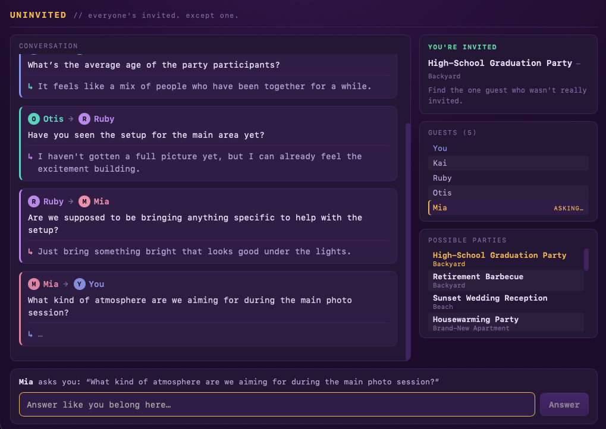

# Uninvited

A local-LLM party deduction game, inspired by **SpyFall** — reskinned as a party.

Everyone at the party is **invited** and knows what the party is… except one
**outsider** who sneaked in and has no idea. Invited guests ask each other
questions to expose the outsider; the outsider blends in and tries to deduce the
party (and can win instantly by guessing it).



You choose, before each game:
1. whether you play as an **invited guest** or **the outsider**, and
2. how many **AI players** join (2–8).

A behind-the-scenes orchestrator runs every AI guest through a single local
**Gemma 4 E2B** model (thinking enabled) and enforces the rules: round-robin
questioning, then a vote. A correct guess by the outsider wins outright; a wrong
one gives them away.

## Stack

- **Tauri v2** desktop shell (Rust).
- **llama-cpp-2** (Metal GPU) running Gemma 4 E2B QAT GGUF, downloaded from
  HuggingFace on first run into `~/.xaghoul-games/brains/` (~3.35 GB).
- **React/HTML** UI (Vite): a conversation-centered view of the party.

## Run

```bash
npm install                 # root (Tauri CLI)
npm --prefix web install    # web deps (React, Vite)
npm run dev                 # tauri dev — launches Vite + the desktop app
```

First launch downloads the model; subsequent launches are instant.

### Env knobs

- `UNINVITED_THINKING=false` — disable the model's reasoning channel.
- `UNINVITED_ROUNDS=3` — questioning rounds before the vote (default 2).
- `UNINVITED_DEBUG_THINKING=1` — surface each AI's hidden reasoning in the
  in-game "AI thoughts" panel (a spoiler — for development/observation only).
- `UNINVITED_DEBUG_RAW=1` — print prompts and raw model output to stderr.

### Headless smoke test

```bash
cargo run --release --example headless -p uninvited   # from src-tauri/
```
